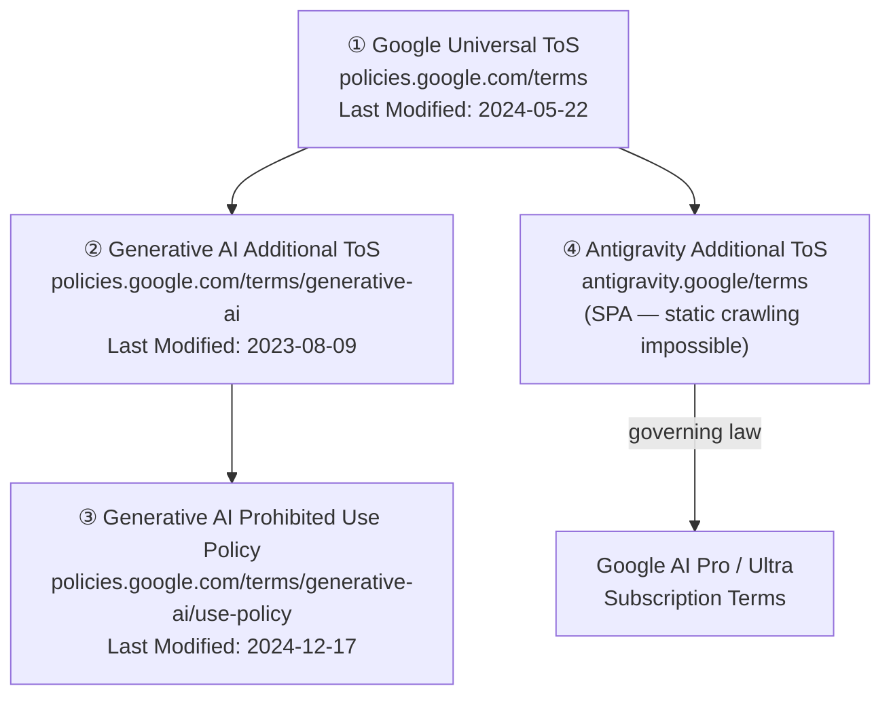
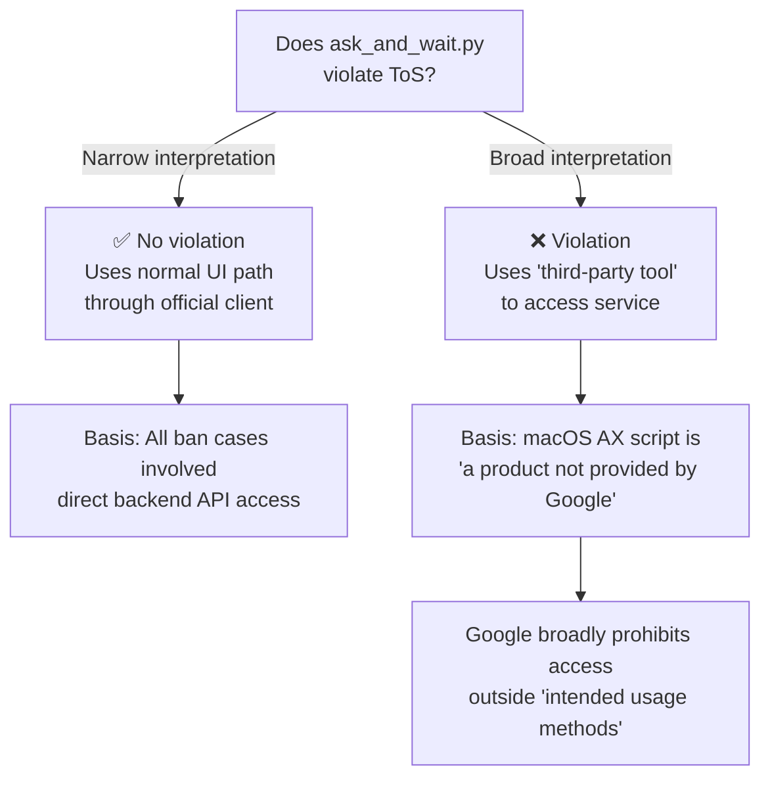

# Antigravity Ban Risk & ToS Comprehensive Analysis Report

> Analysis Date: 2026-03-29 | Read-Only Analyzer Mode
> Sources: Google ToS, Generative AI Additional ToS, Prohibited Use Policy, Community Cases

---

## 1. Applicable Terms of Service Hierarchy (Legal Structure)

The following **4-layer** ToS hierarchy applies to Antigravity automation via `ask_and_wait.py`:



> [!WARNING]
> **Item ④ (Antigravity-specific ToS)** is implemented as a Single Page Application (SPA), making static crawling impossible. The analysis below is based on key provisions confirmed through search engine caches, community documentation, and official web search results.

---

## 2. Key ToS Provisions Analysis — ask_and_wait.py Perspective

### 2.1. Google Universal ToS — "Don't abuse our services" Section

Provisions with **direct violation potential**:

| Provision (Original) | ask_and_wait.py Applicability | Risk Level |
|---|---|---|
| `"spamming, hacking, or **bypassing our systems or protective measures**"` | ⚠️ **Gray zone** — Whether AX API UI manipulation constitutes "bypassing protective measures" is debatable | 🟡 |
| `"accessing or using our services or content in **fraudulent or deceptive ways**"` | ⚠️ **Gray zone** — System prompt injection (JSON Bridge) could be interpreted as "deceptive" usage | 🟡 |
| `"**providing services that appear to originate from you** (or someone else) when they actually originate from us"` | ❌ Not applicable — Personal use, not service provision | 🟢 |
| `"using **automated means** to access content from any of our services **in violation of the machine-readable instructions** on our web pages"` | ❓ **Ambiguous** — robots.txt is web-based; no explicit restriction instructions exist for AX API desktop app access | 🟡 |
| `"reverse engineering our services or underlying technology"` | ❌ Not applicable — Uses normal chat UI, not reverse engineering models | 🟢 |

### 2.2. Generative AI Additional ToS — Key Provisions

| Provision | Original Text | Applicability |
|---|---|---|
| **ML Model Development Ban** | `"You may not use the Services to develop machine learning models or related technology."` | ❌ Not applicable — Coding assistance purpose |
| **Safety Feature Bypass Ban** | `"you may not attempt to bypass these protective measures"` | ⚠️ System prompt injection could be interpreted as safety filter bypass | 🟡 |
| **Usage Restriction Compliance** | `"you must comply with our Prohibited Use Policy"` | ✅ No direct prohibited use violations | 🟢 |

### 2.3. Antigravity Additional ToS (Reconstructed from Web Search)

Key provisions confirmed from official website:

| Provision | Content | ask_and_wait.py Applicability | Risk Level |
|---|---|---|---|
| **Interaction Recording** | Google records and stores "Interactions" (user data, interaction data, metadata, feedback) | ✅ Automation patterns are recorded | 🟠 |
| **Third-Party Tool Prohibition** | "Explicitly prohibits using the service in connection with products not provided by Google" | ⚠️ **Core issue** — Detailed analysis below | 🔴 |
| **User Responsibility** | Full responsibility for AI agent actions rests with the user | ✅ Applicable | ⚪ |
| **Eligibility Requirements** | 18+ years old, Google AI Pro or Ultra subscription required | Subscription status verification needed | ⚪ |

---

## 3. Core Issue: Scope of "Third-Party Tool Prohibition"

### 3.1. Interpretation from Existing Ban Cases

**Common patterns** in cases where Google actually enforced bans:

```
┌───────────────────────────────────────────────────────────────┐
│  Banned Cases (Confirmed)                                     │
│                                                               │
│  ✗ antigravity-claude-proxy: OAuth token extraction → API     │
│  ✗ OpenClaw/ClawdBot: OAuth token injection → external agent  │
│  ✗ Personal scripts: Direct WebSocket connection to Reactor   │
│                                                               │
│  Common element: "Direct backend API access with token abuse" │
└───────────────────────────────────────────────────────────────┘

┌───────────────────────────────────────────────────────────────┐
│  ask_and_wait.py Approach                                     │
│                                                               │
│  ✓ Uses official client (Antigravity IDE)                     │
│  ✓ Normal interaction path through UI                         │
│  ✓ Does NOT extract or reuse OAuth tokens                     │
│  ✓ Does NOT directly access backend API                       │
│                                                               │
│  Difference: "Automatically operates official client's UI"    │
└───────────────────────────────────────────────────────────────┘
```

### 3.2. Legal Interpretation Fork



---

## 4. Detection Mechanism Analysis

### 4.1. Server-Side Detection (Higher Risk)

**Anomalous patterns** detectable by Google servers:

| Signal | Description | ask_and_wait.py Applicable | Mitigation Possible |
|---|---|---|---|
| **Request speed** | Abnormally fast successive messages compared to humans | ⚠️ If script runs in rapid succession | ✅ Adjustable intervals |
| **Session pattern** | Always identical system prompt format | 🔴 Same JSON Bridge prompt injected each time | 🟡 Can vary but fundamental limitation |
| **Interaction metadata** | Mechanical regularity in mouse/keyboard event timing | ⚠️ Fixed intervals like `time.sleep(0.5)` | ✅ Random delay can be added |
| **Input method** | Input via clipboard paste only (no typing events) | 🟡 Normal users also use paste | 🟢 Low risk |

### 4.2. Client-Side Detection (Medium Risk)

Elements detectable by Antigravity IDE itself:

| Signal | Description | Risk Level |
|---|---|---|
| `AXManualAccessibility` setting | Script explicitly sets this attribute to `True` — standard automation tool signature | 🟡 |
| AX tree traversal pattern | Recursive AX tree traversal distinguishable from normal accessibility clients (screen readers, etc.) | 🟡 |
| CGEvent simulation | Events created by `CGEventCreateKeyboardEvent` differ slightly from actual hardware events | 🟢 |

### 4.3. OS-Level Detection (Low Risk)

| Signal | Description | Risk Level |
|---|---|---|
| TCC permission grant record | Python/Terminal accessibility permission recorded in System Settings | 🟢 Personal device |
| Process enumeration | Antigravity could inspect running processes via `NSWorkspace`, but typically doesn't | 🟢 |

---

## 5. Ban Enforcement Case History

### 5.1. OpenClaw/ClawdBot Mass Ban (2026-03)

| Item | Details |
|---|---|
| **Cause** | OAuth token extraction and routing to external agent framework (OpenClaw) |
| **Google's statement** | "malicious usage" — backend infrastructure overload, service quality degradation for other users |
| **Result** | 403 errors, account suspension, **cascade impact on other Google services (Gmail, Workspace)** |
| **Aftermath** | OpenClaw developer (Peter Steinberger) removed official Antigravity integration support |

### 5.2. Google's Policy Evolution

| Timeline | Policy |
|---|---|
| **Initial (2026-01~02)** | Immediate account suspension without warning (Zero-tolerance) |
| **After backlash (2026-03)** | System-wide reset (account restoration), official remediation pathway established |
| **Current** | 1st violation → warning + self-certification form, **2nd violation → permanent ban** |

### 5.3. antigravity-claude-proxy Warnings

Direct quotes from archived project documentation:

> *"⚠️ WARNING: Google has been issuing ToS violation bans on accounts connected to this proxy. Use at your own risk."*
>
> *"Account risk: Providers may detect this usage pattern and take punitive action, including suspension, permanent ban, or loss of access to paid subscriptions."*

---

## 6. ask_and_wait.py Ban Risk Comprehensive Assessment

### 6.1. Risk Matrix

| Assessment Dimension | Score (1-5) | Basis |
|---|---|---|
| **ToS literal violation probability** | 3/5 🟡 | Ambiguous whether "third-party tool prohibition" covers UI automation |
| **Google detection probability** | 2/5 🟢 | Not direct backend access, uses UI path, traffic pattern identical to normal chat |
| **Ban enforcement probability** | 2/5 🟢 | All existing ban cases involved direct API/token abuse; no UI automation ban cases reported |
| **Ban impact severity** | 5/5 🔴 | Cascade impact on entire Google ecosystem (Gmail, Workspace, etc.) possible |
| **Detection evasion feasibility** | 4/5 🟢 | Substantially mitigable through timing randomization, prompt variation, etc. |

### 6.2. Conclusion: Overall Risk Grade

```
╔═══════════════════════════════════════════════════════════════╗
║                                                               ║
║  Overall Ban Risk: 🟡 MEDIUM-LOW                              ║
║                                                               ║
║  Occurrence Probability: Low (15-25%)                         ║
║  Impact Severity: Very High (Entire Google account suspension)║
║  Expected Risk = Probability × Severity → 🟠 CAUTION         ║
║                                                               ║
╚═══════════════════════════════════════════════════════════════╝
```

---

## 7. ask_and_wait.py vs antigravity-claude-proxy Comparison

| Comparison Item | ask_and_wait.py (Current) | antigravity-claude-proxy |
|---|---|---|
| **Access Path** | UI (macOS Accessibility) | Direct backend API calls |
| **Token Usage** | None (uses official client) | OAuth token extraction + reuse |
| **Google Server Perspective** | Indistinguishable from normal chat | Identifiable as unofficial client |
| **Ban Cases** | ❌ None reported | ✅ Multiple reported, Google official response |
| **Speed** | Slow (UI wait, 120s timeout) | Fast (direct API calls) |
| **Stability** | Low (vulnerable to UI changes) | Medium (vulnerable to API changes) |
| **Scalability** | Single session | Multi-account load balancing |
| **ToS Risk Level** | 🟡 Ambiguous (gray zone) | 🔴 Clear violation |

---

## 8. Risk Mitigation Strategies (If Maintaining Current Approach)

> [!IMPORTANT]
> The strategies below reduce risk but do not eliminate it. Under a broad interpretation of the ToS, any automation could be judged as a violation.

### 8.1. Immediately Applicable

1. **Use burner account** — Never use primary account (Gmail, Drive, YouTube, etc.)
2. **Randomize request intervals** — Human-like timing with `time.sleep(random.uniform(3.0, 8.0))`
3. **Limit sessions** — Cap daily requests to human-level (50-100 per day)
4. **Vary prompts** — Slightly modify JSON Bridge system prompt each time

### 8.2. Structural Mitigation

5. **VPN/different IP** — Prepare for potential IP-based ban expansion
6. **Audit logs** — Record all automation sessions as evidence of "non-malicious use"
7. **Usage monitoring** — Actively manage token consumption in `.omg/state/quota-watch.json`

### 8.3. Fundamental Resolution (Recommended)

8. **Use official API** — Switch to Google AI Studio / Vertex AI API (with proper API keys)
9. **Antigravity built-in automation** — Utilize official features like Skills, Workflows, Agent Manager

---

## 9. Final Summary

| Question | Verdict |
|---|---|
| **Does ask_and_wait.py literally violate ToS?** | 🟡 **Ambiguous** — Depends on interpretation of "third-party tool" provision |
| **Can Google detect this pattern?** | 🟡 **Possible but difficult** — Appears as normal chat session from server side |
| **Has Google ever banned for this pattern?** | 🟢 **No reports** — All existing bans involved direct API/token access cases |
| **Would a ban affect the primary account?** | 🔴 **Yes** — Cascade impact on Gmail, Workspace, and entire Google ecosystem confirmed |
| **Recommendation** | 🟠 **Mandatory burner account usage; long-term transition to official API recommended** |
