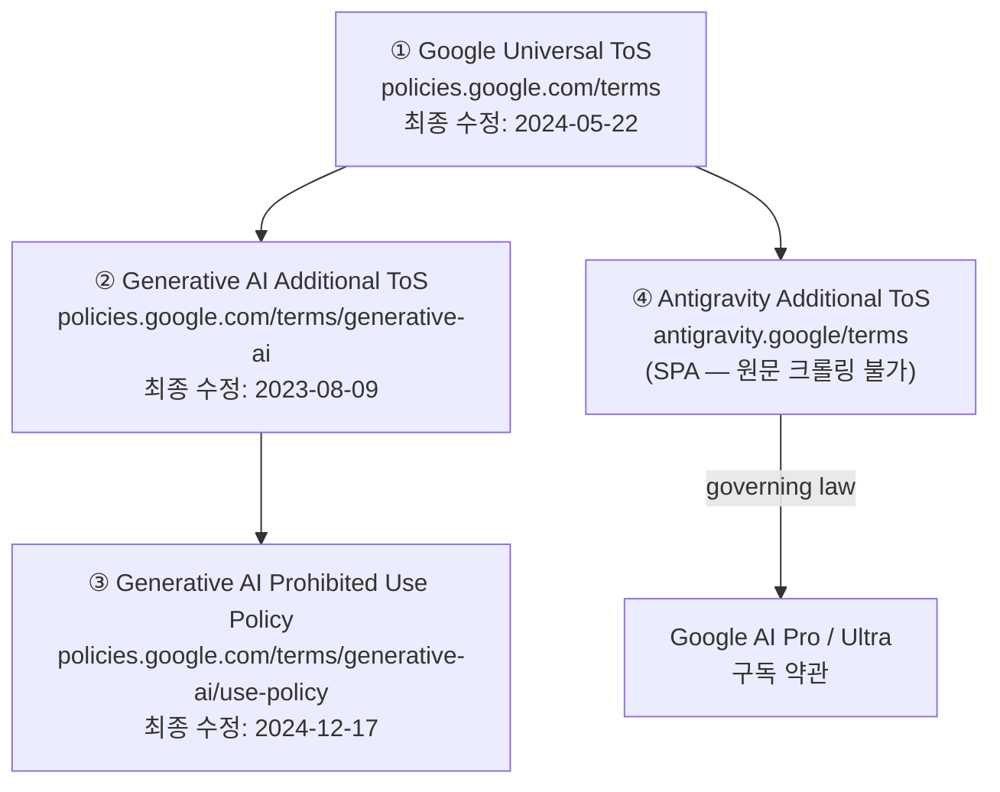
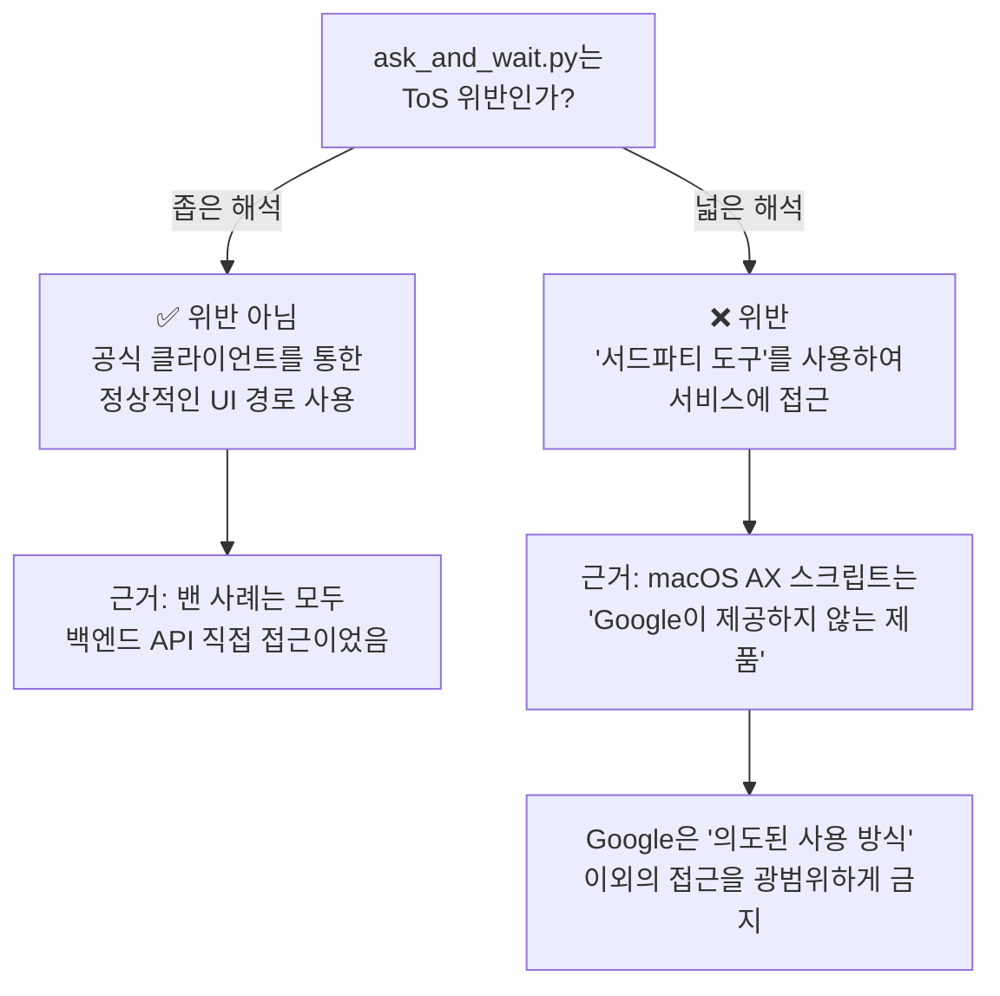

# Antigravity 밴 리스크 및 ToS 종합 분석 보고서

> 분석일: 2026-03-29 | Read-Only Analyzer 모드
> 원문 출처: Google ToS, Generative AI Additional ToS, Prohibited Use Policy, 커뮤니티 사례

---

## 1. 적용되는 약관 체계 (법적 구조)

`ask_and_wait.py`를 통한 Antigravity 자동화에 적용되는 약관은 **4개 계층**으로 구성됩니다:



> [!WARNING]
> **④번 Antigravity 전용 약관**은 SPA(Single Page Application)로 구현되어 있어 정적 크롤링이 불가능합니다. 아래 분석은 검색 엔진 캐시, 커뮤니티 문서, 그리고 공식 웹 검색 결과에서 확인된 핵심 조항을 기반으로 합니다.

---

## 2. 핵심 ToS 조항 분석 — ask_and_wait.py 관점

### 2.1. Google Universal ToS — "Don't abuse our services" 섹션

원문에서 **직접적으로 위반 가능성이 있는 조항**들:

| 조항 원문 (영문) | ask_and_wait.py 해당 여부 | 위험도 |
|---|---|---|
| `"spamming, hacking, or **bypassing our systems or protective measures**"` | ⚠️ **그레이존** — AX API로 UI를 우회 조작하는 것이 "bypassing protective measures"에 해당하는지 논쟁 가능 | 🟡 |
| `"accessing or using our services or content in **fraudulent or deceptive ways**"` | ⚠️ **그레이존** — 시스템 프롬프트 주입(JSON Bridge)이 "deceptive"한 사용으로 해석될 수 있음 | 🟡 |
| `"**providing services that appear to originate from you** (or someone else) when they actually originate from us"` | ❌ 해당 없음 — 개인 사용 목적이므로 서비스 제공이 아님 | 🟢 |
| `"using **automated means** to access content from any of our services **in violation of the machine-readable instructions** on our web pages"` | ❓ **모호** — robots.txt는 웹 기반이고, AX API를 통한 데스크톱 앱 접근에는 명확한 제한 지시가 없음 | 🟡 |
| `"reverse engineering our services or underlying technology"` | ❌ 해당 없음 — 모델을 역공학하지 않고 정상적인 채팅 UI를 사용 | 🟢 |

### 2.2. Generative AI Additional ToS — 핵심 조항

| 조항 | 원문 | 해당 여부 |
|---|---|---|
| **ML 모델 개발 금지** | `"You may not use the Services to develop machine learning models or related technology."` | ❌ 해당 없음 — 코딩 보조 용도 |
| **안전 기능 우회 금지** | `"you may not attempt to bypass these protective measures"` | ⚠️ 시스템 프롬프트 주입이 safety filter 우회로 해석될 가능성 | 🟡 |
| **사용 제한 준수** | `"you must comply with our Prohibited Use Policy"` | ✅ 직접적 금지 사항 해당 없음 | 🟢 |

### 2.3. Antigravity Additional ToS (웹 검색 기반 재구성)

공식 웹사이트에서 확인된 핵심 조항:

| 조항 | 내용 | ask_and_wait.py 해당 여부 | 위험도 |
|---|---|---|---|
| **상호작용 기록** | Google은 "Interactions"(사용자 데이터, 상호작용 데이터, 메타데이터, 피드백)를 기록 및 저장함 | ✅ 자동화 패턴이 기록됨 | 🟠 |
| **서드파티 도구 금지** | "서비스를 Google이 제공하지 않는 제품과 함께 사용하는 것을 명시적으로 금지" | ⚠️ **핵심 쟁점** — 아래 상세 분석 | 🔴 |
| **사용자 책임** | AI 에이전트의 행동에 대한 책임은 전적으로 사용자에게 있음 | ✅ 해당 | ⚪ |
| **자격 요건** | 18세 이상, Google AI Pro 또는 Ultra 구독 필요 | 구독 상태 확인 필요 | ⚪ |

---

## 3. 핵심 쟁점: "서드파티 도구 금지" 조항의 적용 범위

### 3.1. 기존 밴 사례에서의 해석

Google이 실제로 밴을 시행한 사례들의 **공통 패턴**:

```
┌───────────────────────────────────────────────────────────────┐
│  밴 시행된 사례들 (확인됨)                                      │
│                                                               │
│  ✗ antigravity-claude-proxy: OAuth 토큰 추출 → API 프록시     │
│  ✗ OpenClaw/ClawdBot: OAuth 토큰 주입 → 외부 에이전트 프레임워크│
│  ✗ 개인 스크립트: 로컬 데몬(Reactor) WebSocket 직접 연결        │
│                                                               │
│  공통 요소: "백엔드 API에 직접 접근하여 토큰을 우회 사용"          │
└───────────────────────────────────────────────────────────────┘

┌───────────────────────────────────────────────────────────────┐
│  ask_and_wait.py의 접근 방식                                   │
│                                                               │
│  ✓ 공식 클라이언트(Antigravity IDE) 사용                       │
│  ✓ UI를 통한 정상적인 상호작용 경로                              │
│  ✓ OAuth 토큰을 추출하거나 재사용하지 않음                       │
│  ✓ 백엔드 API에 직접 접근하지 않음                              │
│                                                               │
│  차이점: "공식 클라이언트의 UI를 자동으로 조작"                    │
└───────────────────────────────────────────────────────────────┘
```

### 3.2. 법적 해석 분기점



---

## 4. 감지 메커니즘 분석

### 4.1. 서버 측 감지 (높은 위험)

Google 서버가 감지할 수 있는 **비정상 패턴**:

| 신호 | 설명 | ask_and_wait.py 해당 | 완화 가능성 |
|---|---|---|---|
| **요청 속도** | 인간과 비교해 비정상적으로 빠른 연속 메시지 | ⚠️ 스크립트가 빠르게 반복 실행될 경우 | ✅ 간격 조절 가능 |
| **세션 패턴** | 항상 동일한 시스템 프롬프트 포맷 | 🔴 매번 동일한 JSON Bridge 프롬프트 주입 | 🟡 변형 가능하나 근본적 한계 |
| **상호작용 메타데이터** | 마우스/키보드 이벤트 타이밍의 기계적 규칙성 | ⚠️ `time.sleep(0.5)` 등 고정 간격 | ✅ 랜덤 지연 추가 가능 |
| **입력 방식** | 클립보드 붙여넣기로만 입력 (타이핑 이벤트 없음) | 🟡 정상 사용자도 붙여넣기 사용 | 🟢 낮은 위험 |

### 4.2. 클라이언트 측 감지 (중간 위험)

Antigravity IDE 자체가 감지할 수 있는 요소:

| 신호 | 설명 | 위험도 |
|---|---|---|
| `AXManualAccessibility` 설정 | 스크립트가 명시적으로 이 속성을 `True`로 설정 — 이는 자동화 도구의 표준 시그니처 | 🟡 |
| AX 트리 탐색 패턴 | 재귀적 AX 트리 순회는 일반적인 접근성 클라이언트(스크린 리더 등)와 구별 가능 | 🟡 |
| CGEvent 시뮬레이션 | `CGEventCreateKeyboardEvent`가 생성하는 이벤트는 실제 하드웨어 이벤트와 약간 다름 | 🟢 |

### 4.3. OS 수준 감지 (낮은 위험)

| 신호 | 설명 | 위험도 |
|---|---|---|
| TCC 권한 부여 기록 | System Settings에 Python/Terminal의 접근성 권한이 기록됨 | 🟢 개인 기기 |
| 프로세스 열거 | Antigravity가 `NSWorkspace`로 실행 중인 프로세스를 검사할 수 있지만, 일반적으로 하지 않음 | 🟢 |

---

## 5. 밴 시행 사례 연대기

### 5.1. OpenClaw/ClawdBot 대규모 밴 (2026-03)

| 항목 | 내용 |
|---|---|
| **원인** | OAuth 토큰을 추출하여 외부 에이전트 프레임워크(OpenClaw)로 라우팅 |
| **Google의 명시** | "malicious usage" — 백엔드 인프라 과부하, 다른 사용자의 서비스 품질 저하 |
| **결과** | 403 에러, 계정 정지, **다른 Google 서비스(Gmail, Workspace)까지 영향** |
| **여파** | OpenClaw 개발자(Peter Steinberger)가 Antigravity 통합 공식 지원 제거 |

### 5.2. Google의 대응 변화

| 시점 | 정책 |
|---|---|
| **초기 (2026-01~02)** | 무경고 즉시 계정 정지 (Zero-tolerance) |
| **반발 후 (2026-03)** | 시스템 전체 리셋 (pivcyeongyi 복구), 공식 구제 절차(Remediation) 마련 |
| **현재** | 1차 위반 → 경고 + 자기 인증 양식, **2차 위반 → 영구 밴** |

### 5.3. antigravity-claude-proxy의 경고

아카이브된 프로젝트 문서에서 직접 인용:

> *"⚠️ WARNING: Google has been issuing ToS violation bans on accounts connected to this proxy. Use at your own risk."*
>
> *"Account risk: Providers may detect this usage pattern and take punitive action, including suspension, permanent ban, or loss of access to paid subscriptions."*

---

## 6. ask_and_wait.py 밴 리스크 종합 평가

### 6.1. 리스크 매트릭스

| 평가 차원 | 점수 (1-5) | 근거 |
|---|---|---|
| **ToS 문언 위반 가능성** | 3/5 🟡 | "서드파티 도구 금지"가 UI 자동화까지 포괄하는지 모호 |
| **Google 감지 가능성** | 2/5 🟢 | 백엔드 직접 접근 아님, UI 경로 사용, 트래픽 패턴은 정상 채팅과 동일 |
| **밴 시행 가능성** | 2/5 🟢 | 기존 밴 사례는 모두 API/토큰 직접 악용, UI 자동화 밴 사례는 보고 없음 |
| **밴 시 피해 심각도** | 5/5 🔴 | Gmail, Workspace 등 전체 Google 생태계에 연쇄 영향 가능 |
| **감지 회피 가능성** | 4/5 🟢 | 타이밍 랜덤화, 프롬프트 변형 등으로 상당 부분 완화 가능 |

### 6.2. 결론: 종합 위험 등급

```
╔═══════════════════════════════════════════════════════════════╗
║                                                               ║
║  종합 밴 리스크: 🟡 중-저 (MEDIUM-LOW)                         ║
║                                                               ║
║  발생 확률: 낮음 (15-25%)                                      ║  
║  피해 심각도: 매우 높음 (Google 전체 계정 정지 가능)              ║
║  기대 위험 = 확률 × 심각도 → 🟠 주의 (CAUTION)                  ║
║                                                               ║
╚═══════════════════════════════════════════════════════════════╝
```

---

## 7. ask_and_wait.py vs antigravity-claude-proxy 비교

| 비교 항목 | ask_and_wait.py (현재) | antigravity-claude-proxy |
|---|---|---|
| **접근 경로** | UI (macOS Accessibility) | 백엔드 API 직접 호출 |
| **토큰 사용** | 없음 (공식 클라이언트 사용) | OAuth 토큰 추출 + 재사용 |
| **Google 서버 관점** | 정상 채팅과 구별 불가 | 비공식 클라이언트로 식별 가능 |
| **밴 사례** | ❌ 보고 없음 | ✅ 다수 보고, Google 공식 대응 |
| **속도** | 느림 (UI 대기, 120초 타임아웃) | 빠름 (직접 API 호출) |
| **안정성** | 낮음 (UI 변경에 취약) | 중간 (API 변경에 취약) |
| **확장성** | 단일 세션 | 다중 계정 로드밸런싱 |
| **ToS 위험도** | 🟡 모호 (그레이존) | 🔴 명확한 위반 |

---

## 8. 위험 완화 전략 (현재 접근 유지 시)

> [!IMPORTANT]
> 아래 전략은 위험을 낮출 뿐, 제거하지 않습니다. ToS의 넓은 해석에 따르면 어떤 자동화든 위반으로 판단될 수 있습니다.

### 8.1. 즉시 적용 가능

1. **버너 계정 사용** — 본 계정(Gmail, Drive, YouTube 등)을 절대 사용하지 않음
2. **요청 간격 랜덤화** — `time.sleep(random.uniform(3.0, 8.0))` 등 인간 유사 타이밍
3. **세션 제한** — 1일 요청 수를 인간 수준(50-100회)으로 제한
4. **프롬프트 변형** — JSON Bridge 시스템 프롬프트를 매번 약간씩 변형

### 8.2. 구조적 완화

5. **VPN/다른 IP** — 밴이 IP 기반으로 확장될 경우를 대비
6. **감사 로그** — 모든 자동화 세션을 기록하여 "비악의적 사용" 입증 자료 확보
7. **사용량 모니터링** — `.omg/state/quota-watch.json`의 토큰 소비량을 적극 관리

### 8.3. 근본적 해결 (추천)

8. **공식 API 사용** — Google AI Studio / Vertex AI API로 전환 (정식 API 키 사용)
9. **Antigravity 내장 자동화** — Skills, Workflows, Agent Manager 등 공식 기능 활용

---

## 9. 최종 요약

| 구분 | 판정 |
|---|---|
| **ask_and_wait.py가 ToS를 문언적으로 위반하는가?** | 🟡 **모호** — "서드파티 도구" 조항의 해석에 따라 다름 |
| **Google이 이 패턴을 감지할 수 있는가?** | 🟡 **가능하나 어려움** — 서버에서는 정상 채팅 세션으로 보임 |
| **Google이 이 패턴을 이유로 밴을 시행한 적 있는가?** | 🟢 **보고 없음** — 기존 밴은 모두 API/토큰 직접 접근 사례 |
| **밴이 발생하면 본 계정도 위험한가?** | 🔴 **예** — Gmail, Workspace 등 전체 Google 서비스에 연쇄 영향 확인됨 |
| **권장 사항** | 🟠 **반드시 버너 계정 사용, 장기적으로 공식 API 전환 권고** |
